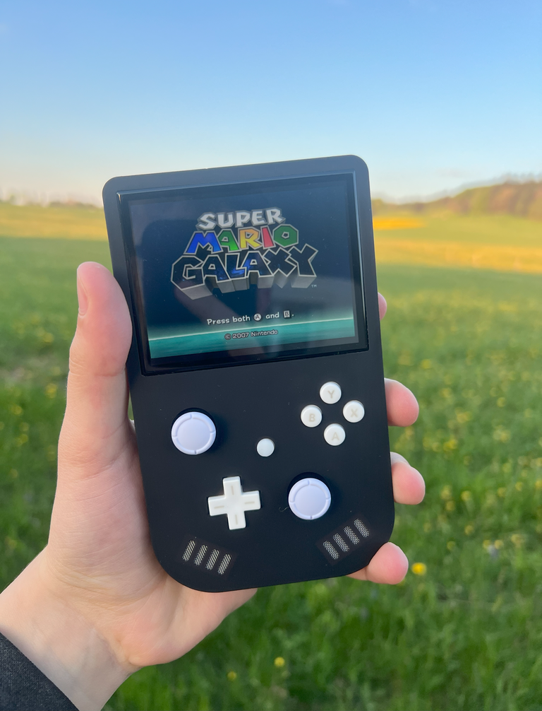

<picture> <source media="(prefers-color-scheme: dark)" srcset="Images/XBU-BR-Light.png" width="800">  </picture> 
  
  

The Xii-Boy Ultra is a small and compact portable Wii using a vertical layout.
This third revision offers all the latest fonctionnalities, as long as the WireFree system, which allows easily assemble and dissasemble the system without solder iron, just a screwdriver.

Everything has been approved an updated to receive the last 4LayerTechnologies PCB, including PMS2 which allows showing the battery level at any time, as long as the RVL-DD for the best video quality / compatibility possible.

It also integrates a brand new analog trigger system using Nintendo Switch joysticks, the WiFi module for online game, Bluetooth to connect the original WiiMote controllers, and more!
Check out this thread for further informations: [BITBUILT THREAD]

⚠️ THIS BETA REVISION MIGHT CONTAIN ISSUES, MISTAKES OR ELSE. ⚠️

# Parts
All the needed parts are listed in the [Xii-Boy Ultra Parts list](https://github.com/Xenii1642/Xii-Boy-Ultra/blob/main/Parts.pdf)
Most of the parts come from Aliexpress, which might not be idea due to the recent tarrifs modifications. If you find some parts on another website, please let me know 👍

🔋For the batteries, I personally recommend those: [Recommended XBU Batteries](https://www.akkuteile.de/samsung-inr18650-35e-3-6v-3-7v-3500mah-pluspol-flach_100631_3391)
There is plenty of website that sell batteries. You should aquire them from a source you're confident with. If you live in Europe, I highly recommend [Akkuteile](https://www.akkuteile.de/). 
It's a German website and I always been pleased by their services.

You'll also noticed that the 40 pins ribbon cable might be replaced by the [40p Shielded FFC](https://github.com/Xenii1642/Xii-Boy-Ultra/blob/main/PCB/Gerbers/Shielded%20FFC.zip) I designed due to the interferance issues I had with the normal one.

⚠️ Be careful to buy them from a reliable source to avoid contracts. Fake batteries can be etremly dangerous. ⚠️

# PCBs
All the PCBs files are availble in the [PCB section](https://github.com/Xenii1642/Xii-Boy-Ultra/tree/main/PCB)
If you just want to order them, you can use the [Gerber files](https://github.com/Xenii1642/Xii-Boy-Ultra/tree/main/PCB/Gerbers). Multiple manufacters work, My preference is [JLCPCB](https://jlcpcb.com/)
You can also make edits using the [Kicad 9 files](https://github.com/Xenii1642/Xii-Boy-Ultra/tree/main/PCB/KiCad%209%20Files).

For the components, everything is listed in the [PCB BOM File](https://github.com/Xenii1642/Xii-Boy-Ultra/blob/main/PCB%20BOM.pdf). For the moment, there are only the Digikey links, I haven't found all the parts on Mouser yet.

Ordering PCB is a pretty important step, and you shoudl really put the correct settings while ordering, otherwire you could run into issues.
For exemple, even though ENIG cover is more epxnsive, it's absolutly nessessary for the Controller PCB. Otherwise, the buttons won't respond well, and might not work anymore after 3 months.

Here is a list of every settings per board:
### [**Main PCB (XBU-001)**:](https://github.com/Xenii1642/Xii-Boy-Ultra/blob/main/PCB/Gerbers/Main%20PCB.zip)
- Impedance Control: YES
- Impedance Control profile: JLC04161H-7628
- Thickness: 1.6mm
  
### [**Xii-DD (XBU-002)**:](https://github.com/Xenii1642/Xii-Boy-Ultra/blob/main/PCB/Gerbers/Xii-DD.zip)
- Thickness: 1.2mm
  
### [**Controller PCB (XBU-003)**:](https://github.com/Xenii1642/Xii-Boy-Ultra/blob/main/PCB/Gerbers/Controller%20PCB.zip)
- Thickness: 1.6mm
- Surface finish: ENIG

### [**Xii-Flex Ultra (XBU-004)**:](https://github.com/Xenii1642/Xii-Boy-Ultra/blob/main/PCB/Gerbers/Xii-Flex%20Ultra.zip)
- Thickness: 1.12mm (💡0.11mm also works, but it's way riskier and more fragile according to some people. I personnaly didn't notice a lot of differences.)
- Stiffener: YES, Polyimide 0.2mm

### [**Trigger PCB (XBU-005)**:](https://github.com/Xenii1642/Xii-Boy-Ultra/blob/main/PCB/Gerbers/Trigger%20PCB.zip)
- Thickness: 1.16mm

### [**Xii-Strip (XBU-006)**:](https://github.com/Xenii1642/Xii-Boy-Ultra/blob/main/PCB/Gerbers/Xii-Strip.zip)
- Thickness: 0.8mm

### [**40p Shielded FFC (XBU-007)**:](https://github.com/Xenii1642/Xii-Boy-Ultra/blob/main/PCB/Gerbers/Shielded%20FFC.zip)
- Thickness: 0.12 (💡For that baord, 0.11mm also works well)
- Stiffener: YES, Polyimide 0.2mm

You can also change the color if you want, but you shouldn't change anything else if you're not sure what you're doing.

# Case
The 3D files are all available in the [3D Section](https://github.com/Xenii1642/Xii-Boy-Ultra/tree/main/3D).
However, they are some differences between some files. 
First, there are two different kind of files.
[STL](https://github.com/Xenii1642/Xii-Boy-Ultra/tree/main/3D/STL) are classic 3D files. They can be use for ordering, or directly 3D printing throught a slicer software. They are considered as "fabrication files" meaning they can almost not be editable.
[STEP](https://github.com/Xenii1642/Xii-Boy-Ultra/tree/main/3D/STEP) can also be used in a slicer or to order, but it also allows making changes and edits on the shell. 

On top of that, there are also two version of the top shell:
### **FMD**:
If you have a classic FMD 3D Printer, or planned printing the case on one, you should use the [FMD](https://github.com/Xenii1642/Xii-Boy-Ultra/tree/main/3D/STL/FDM) version of the file.
The main change is the screen tolerance, which isn't the same on FDM. This version only use a Friction Fit technology, and the 3D printed layers help the screen to get stuck in place.

### **Resin & SLS**:
If you planned ordering the case through [JLC3DP](https://jlc3dp.com/) or [PCBWay](https://www.pcbway.com/), or simply printing one yourself with a resin printer, you should use the [Resin & SLS case](https://github.com/Xenii1642/Xii-Boy-Ultra/tree/main/3D/STL/Resin%20%26%20SLS).
Considering the shell is much smoother here, normal Friction Fit doesn't work well, and the screen might pop off pretty easily.
To avoid that, those versions have a Super Friction Fit technology, which mimic the FMD layers and make the screen strongly attached to the screen.

The 3D files are also available on my Printable account [Xii-Boy Ultra 3D parts]

# Support
The Xii-Boy Ultra is only on a BETA revision.
This means, there could be some mistakes somewhere.
Troubleshooting a whole design like this is tricky, and I might have not seen all the mistakes.
Reason why you should absolutly tell me if you notice some.
There is also no assembly guide for the moment.

To sum up, the Xii-Boy Ultra might currently be not for beginners.
If you have soldering knowledge, and know how to assemble it without any guide, just by logical reasonning, then you can definitively make it!
Otherwise, I suggest you to wait for the upcoming kits.

Feel free to contact me if you need any informations or help about the design. Please let me know if you find any issues. It will help a lot making the project better.
Thanks for your understanging and your support!
