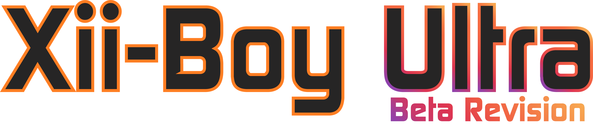
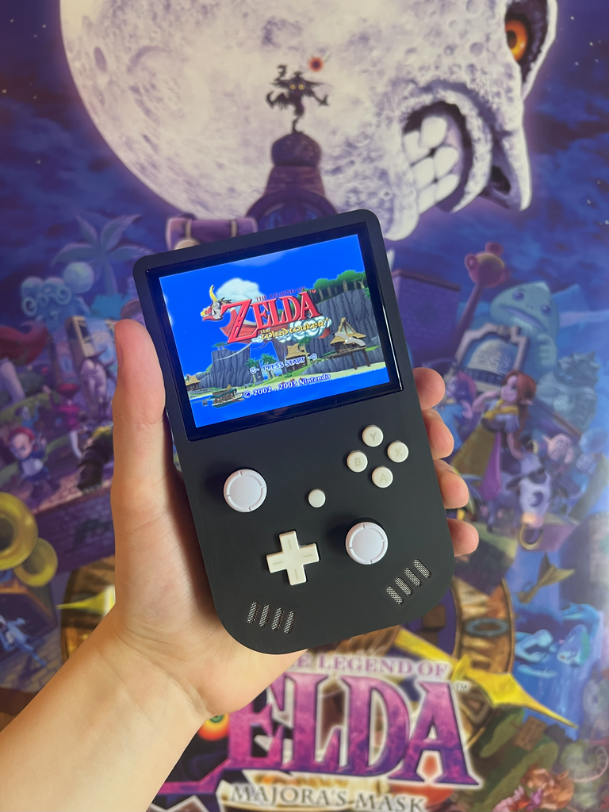
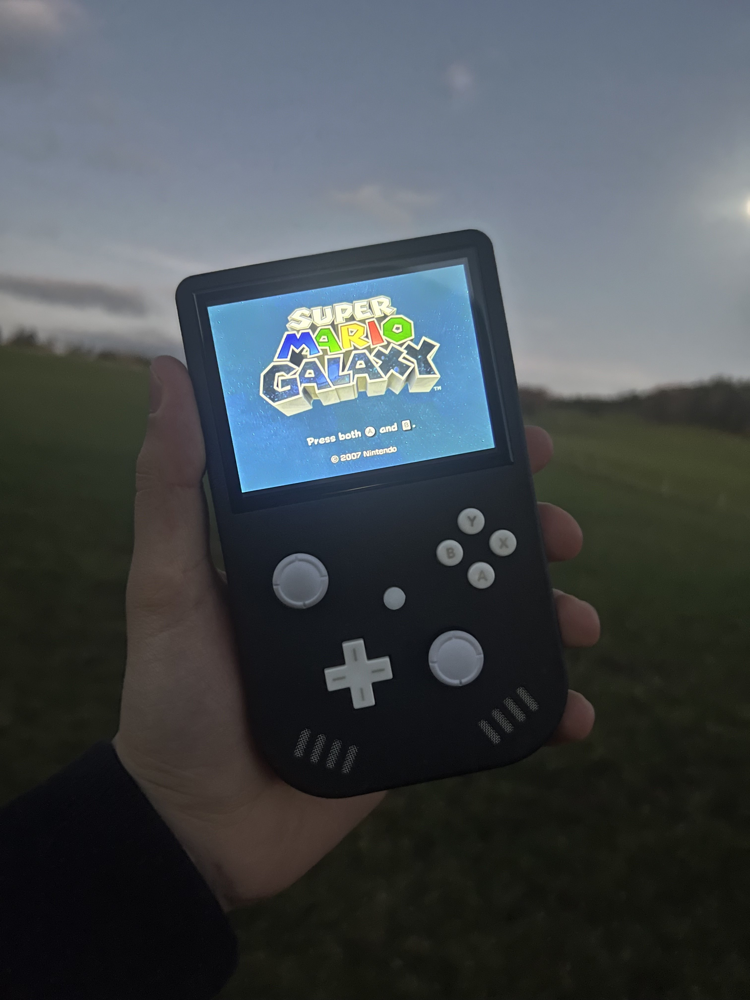
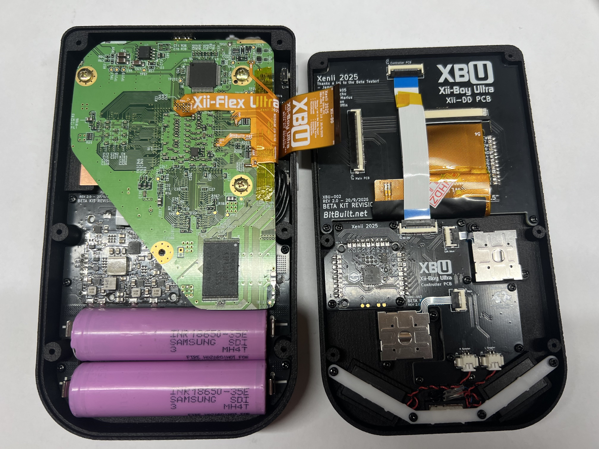

  
  

Have you ever dreamed of a portable Wii before? Or even one with Wifi and Bluetooth integration? 
What about analog triggers, and RVL-DD? Or the Wire-free system that allows you to entirely dissasemble the system without any soldering iron?

Well, I'm here to tell that that dream came true, and I called it the Xii-Boy Ultra. 

This new Xii-Boy Ultra is the third and latest edition of my Xii-Boy design I first started almost 2 years ago. 
It comes with all the latest features everyone has been dreaming of for years. This means many crazy mods like the RVL-DD,
or all the cool stuff over the [4Layer Technologies](https://4layertech.com/), analog triggers for full Gamecube games compatibility,
optional WiFi and Bluetooth functionalities to play online or to use an original WiiMote controller and so many others. 
Everything is nicely packed up inside that little portable, 25% smaller than the previous Gboy III. 

Further technical specifications can be found on the following links:
- [Xii-Boy Ultra Worklog](https://bitbuilt.net/forums/threads/xii-boy-ultra-v3.6641/)
- [Xii-Boy Ultra Beta Release](https://bitbuilt.net/forums/threads/the-xii-boy-ultra-v3-beta-release.6918/)
- [Xii-Boy Ultra REV 2 Release](https://bitbuilt.net/forums/threads/xii-boy-ultra-rev-2.7108/#post-74825)

I've been working on the possibility to offer kits to the community for the last 7 months. 
Over that time, the design received a lot of changes to improve reliability, compatibility and overall quality of the build. 
This branche of the repository is all about the latest Revision 2 of the design. It is made with the kits in mind, and is the revision the 6 beta testers will receive for a review.

I personally assembled that latest revision by myself, and it has been confirmed working, reason why I'm sharing everything here!

⚠️ Due to the complexity nature of the build, and the knowledge it requires to build or use, I can't be held responsible for any issues, accidents or injuries that may occur. 
This Beta Reivision might also come with design flaws or issues. Please contact me of the Xii-Boy Team in case you notice any. ⚠️

# Availability
For now, the design cannot be purchased as a kit. This will hopefully change in a few months, even though I have no idea of when the kits will become available. Stay tuned on my Worklog.
This means the only alternative is to source all the parts on yourself and to assemble everything on your side. 

Please take a look at the following points carefully. 

# Parts
Everything you need to build your own can be found in the [Xii-Boy Ultra Parts list](https://github.com/Xenii1642/Xii-Boy-Ultra/blob/REV-2.0/Parts-List.pdf) file. 
Please note that most of the articles are only available through Aliexpress, which might not be ideal due to the tariffs situation.

🔋For the batteries, I personally recommend those: [Recommended Batteries](https://www.akkuteile.de/samsung-inr18650-35e-3-6v-3-7v-3500mah-pluspol-flach_100631_3391)
There is plenty of website that sell batteries. You should aquire them from a source you're confident with. If you live in Europe, I highly recommend [Akkuteile](https://www.akkuteile.de/). 
It's a German website and I always been pleased by their services. ⚠️ Be careful to order them from a reliable source to avoid counterfeiting. Fake batteries can be extremly dangerous. ⚠️

# PCBs
As all the build, the Xii-Boy Ultra PCBs are all open-sourced. If you just want to order them, you can use the [Gerber files](https://github.com/Xenii1642/Xii-Boy-Ultra/tree/REV-2.0/Gerbers).
Multiple manufacters work, but I suggest either [JLCPCB](https://jlcpcb.com/) or [PCBWay](https://pcbway.com) for that build.

You can also make edits using the [Kicad 9 files](https://github.com/Xenii1642/Xii-Boy-Ultra/tree/REV-2.0/KiCad%20Files).

For the components, everything is listed in the [PCB BOM File](https://github.com/Xenii1642/Xii-Boy-Ultra/blob/REV-2.0/PCB-BOM.pdf). 
Some articles can only be found on Digikey, reason why all the parts of this list come from them. 

Ordering PCB is one of the most important step, and you should really make sure to enable the correct settings while ordering, otherwise you could run into multiple issues.
Many of the following boards **will not** work with the default settings, so please make sure to order them with the proper settings 👍

Here is a list of all the settings for each board:
### [**Main PCB (XBU-001)**:](https://github.com/Xenii1642/Xii-Boy-Ultra/blob/REV-2.0/Gerbers/Main%20PCB.zip)
- Material: FR4
- Specify Stackup: YES
- Stackup profile: JLC04161H-7628
- Thickness: 1.6mm
  
### [**Xii-DD (XBU-002)**:](https://github.com/Xenii1642/Xii-Boy-Ultra/blob/REV-2.0/Gerbers/Xii-DD.zip)
- Material: FR4
- Thickness: 1.2mm
  
### [**Controller PCB (XBU-003)**:](https://github.com/Xenii1642/Xii-Boy-Ultra/blob/REV-2.0/Gerbers/Controller%20PCB.zip)
- Material: FR4
- Thickness: 1.6mm
- Surface finish: ENIG

### [**Xii-Flex Ultra (XBU-004)**:](https://github.com/Xenii1642/Xii-Boy-Ultra/blob/REV-2.0/Gerbers/Xii-Flex%20Ultra.zip)
- Material: Flex
- Thickness: 0.12mm (💡0.11mm also works, but it's way riskier and more fragile according to some people. I personnaly didn't notice a lot of differences.)
- Stiffener: YES, Polyimide 0.2mm

### [**Trigger PCB (XBU-005)**:](https://github.com/Xenii1642/Xii-Boy-Ultra/blob/REV-2.0/Gerbers/Trigger%20PCB.zip)
- Material: FR4
- Thickness: 1mm

### [**Xii-Strip (XBU-006)**:](https://github.com/Xenii1642/Xii-Boy-Ultra/blob/REV-2.0/Gerbers/Xii-Strip.zip)
- Material: FR4
- Thickness: 0.8mm

### [**40p Shielded FFC (XBU-007)**:](https://github.com/Xenii1642/Xii-Boy-Ultra/blob/REV-2.0/Gerbers/Shielded%20FFC.zip)
- Material: Flex
- Thickness: 0.12 (💡For that baord, 0.11mm also works well)
- Stiffener: YES, Polyimide 0.2mm

Color and can be changed, but make sure to only modify the settings you're confident with. 

# Shell
The shell files are all available in the [3D Section](https://github.com/Xenii1642/Xii-Boy-Ultra/tree/REV-2.0/3D).
Since STL can only be ordered and not edited, I decided to only share the STEP files, which allow both editing and ordering without any issues. 

Some files have minors changes, so make sure to read the following points to understand the one you need for your use.
### **FDM**:
If you have a classic FDM 3D Printer, or planned printing the case on one, you should use the [FDM](https://github.com/Xenii1642/Xii-Boy-Ultra/tree/REV-2.0/3D/Shell/FDM) version of the files.
Screen's friction fit doesn't have the same tolerances on FDM and SLS/SLA. Choosing the wrong file might occur into the screen to not fit at all, or to not stick at all, causing it to fall.

### **SLS-SLA**:
If you planned ordering the case through [JLC3DP](https://jlc3dp.com/) or [PCBWay](https://www.pcbway.com/) using Nylon (SLS or MJF) or Resin (SLA), or simply printing one yourself with a resin printer,
you should use the [Resin & Nylon](https://github.com/Xenii1642/Xii-Boy-Ultra/tree/REV-2.0/3D/Shell/SLS-SLA) file.
Considering the shell is much smoother here, normal Friction Fit doesn't work well, and the screen might pop off pretty easily.
To avoid that, those versions have a Super Friction Fit technology, which mimic the FDM layers and make the screen strongly attached into the shell.

⚠️ Disclamer: SLA + spray varnish is something to avoid, since it adds enough volume to make the parts to not fit properly. 

### **Stands**
You can also find the Xii-Boy Ultra stands in the [stands folder](https://github.com/Xenii1642/Xii-Boy-Ultra/tree/REV-2.0/3D/Stands) or on my Printables account: [Xii-Boy Ultra stands - Printables](https://www.printables.com/model/1307105-xii-boy-ultra-stands)
One of them has a slot for the [XiiSBar](https://github.com/Xenii1642/XiiSBar), which allows you to play game with the IR pointer (original WiiMote pointing system)

# Software
The Xii-Boy Ultra runs on RVLoader, a wonderful homebrew app made by Aurelio over the BitBuilt forum. However, it needs to be slightly modified for all the Xii-Boy Ultra features to work properly.

You'll find all the new files you need to update in the [Software](https://github.com/Xenii1642/Xii-Boy-Ultra/tree/REV-2.0/Software) section of the repository.

⚠️ Those files are tempoary and have been modified for the Xii-Boy Ultra only. They might contain issues or instablities. Update at your own risks. ⚠️
### [GCPlus2.0Update.hex](https://github.com/Xenii1642/Xii-Boy-Ultra/blob/main/Software/GCPlus2.0Update.hex)
This file is used to update the GC+ 2 from [4LayerTech](https://4layertech.com/) with a new version compatible with the Xii-Boy Ultra analog trigger system.
To update your GC+ 2.0, simply copy/paste that file in the root of your Xii-Boy Ultra µSD card.

### [boot.dol](https://github.com/Xenii1642/Xii-Boy-Ultra/blob/main/Software/boot.dol):
This files is used to add Volume and Brightness over buttons in Gamecube games.
To add those features, simply drag and replace the original file in `/apps/Nintendont`.

### [LCDDriver.bit](https://github.com/Xenii1642/Xii-Boy-Ultra/blob/main/Software/LCDDriver.bit)
This file is used to flash the DD software when booting. The original one, present by default in RVLoader contains a little issue with i2C.
It results into random crashes and volume or brightness control interferances. This file also removes the whine coil noise the old DD bitstream caused.
To install it, you just have to replace the original file in the root of your µSD card. ⚠️ This file or the previous one is necessary for the portable to boot ⚠️

### [hud.elf](https://github.com/Xenii1642/Xii-Boy-Ultra/blob/main/Software/hud.elf)
Like boot.dol, this file is used to add Volume and Brightness over buttons in Wii games.
To add those features, simply drag and replace the original file in `/rvloader/Hiidra/modules`

Once everything has been installed, safety eject your µSD card / Xii-Boy Ultra console.
Boot it up and go to `Settings` --> `Controller` --> `Firmware Update`
If everything has been done correctly, your Xii-Boy Ultra should be udpated.
Set your `Triggers mode` to `Analog` and press `Save Config`
Reboot your device and go to `Settings` --> `Controller` --> `Buttons Tester`
You should now see all the buttons and the analog triggers working!

# General Software Setting:
- In `Power` --> `Charge Settings`, `Battery Capacity` needs to be set at 7000mAh (or the capacity of one cell *2 `3500mAh *2 = 7000mAh`)
- `Charging Current` should be set at 3520mA
- `Precharge` and `Termination current` should be set at 128mA
- `Charge Voltage` should be set at 4200mV
- In `Misc Settings`, you need to change `Status LED type:` to `Adressable Type B`
- in `Audio`, `Volume control system` needs to be set to Buttons.
💡You can adapt all the settings depends on you. I personally set the `Status LED Intensity` to 5 and the `Rumble Intensity` to 60.

💡Make sure to test all the features, you should launch a Wii and a GameCube game, to make sure everything is working fine.

# Revisions
- REV0 - 1/1/2025 (First prototype not available)
- [REV1](https://github.com/Xenii1642/Xii-Boy-Ultra/tree/REV-1.0) - 18/5/2025 (Fixes the previous issues, first released revision)
- [REV2](https://github.com/Xenii1642/Xii-Boy-Ultra/tree/REV-2.0) - 16/11/2025 CURRENT (Fixes all the previous issues, removes pogo pins and upgrade a lot the reliability)

# Credits
Time to mention everybody who helped along the project!
- The Xii-Boy Team (JamesPi, BryceShaw, and I)
- YveltalGriffin (Help about PCB Design)
- Aurelio (RVLoader devloppement and software help) 
- All the Beta Testers (Modding Marius, Supertazon, YveltalGriffin, Macho Nacho, JamesPi, JoshsJunk05) 👍
  
# License
All Xii-Boy Ultra revisions are released under the CERN-OHL-S-2.0 license. 
This license allows you to:
- Study
- Modify
- Manufacture
- Sell
- Distribute

Any modified versions of derivatives must also remain open-source under **the same, unmodified license**
You must also properly credit the original creators when reusing or redistributing these files.

# Support
Due to the early Beta Release of the Xii-Boy Ultra, the design might contain issues, design flaws or other things.
This new REV2 corrected **all** the issues the previous revision had. But it doesn't mean it doesn't contain any. 

If you notice any issues, or things that could/should me updated, or even general recommendation, feel free to reach out for letting me know.
You can also ask help over the BitBuilt community (Discord server or forums), and I'd be happy to help. 

I'd also be grateful to receive feeback of the design. You can freely say what you thought about it, what you liked, disliked, etc.

Thanks a lot for the support and the help! Your feeback help a lot to make this product as perfect as possible!

I wish you all the best. Have fun!
